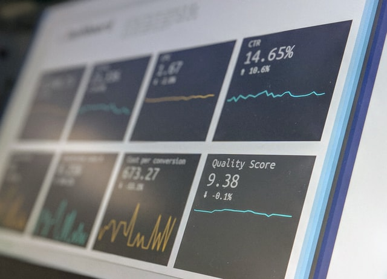

# About Me
*Working in Business Intelligence and creating educational content*

# Education
* Professional in Business Administration, 2014-2019

# [Project 1: Crypto Sentiment Analysis](http://youtube.com/dataprofessor)

Photo by <a href="https://unsplash.com/@silverhousehd?utm_source=unsplash&utm_medium=referral&utm_content=creditCopyText">André François McKenzie</a> on <a href="https://unsplash.com/s/photos/cryptocurrency?utm_source=unsplash&utm_medium=referral&utm_content=creditCopyText">Unsplash</a>

This project integrates various news source for performing sentiment analysis pertaining to cryptocurrencies.
* **Python libraries used:** Streamlit, Huggingface, TensorFlow
* **Input:** Tweets, News
* **Output:** Sentiment of Cryptocurrency

# [Project 2: Crypto Trading Bot](http://youtube.com/dataprofessor)

Photo by <a href="https://unsplash.com/@dawson2406?utm_source=unsplash&utm_medium=referral&utm_content=creditCopyText">Stephen Dawson</a> on <a href="https://unsplash.com/s/photos/technical-analysis?utm_source=unsplash&utm_medium=referral&utm_content=creditCopyText">Unsplash</a>

This project makes use of ***sentiment analysis*** of cryptocurrency coupled with ***technical analysis*** in the trading of cryptocurrencies.
* **Python libraries used:** Streamlit, python-binance, cctx, talib
* **Input:** Cryptocurrency historical price
* **Output:** Trading signals triggers buying and selling
